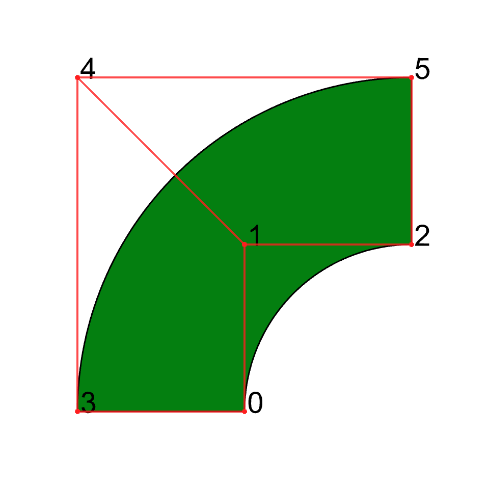
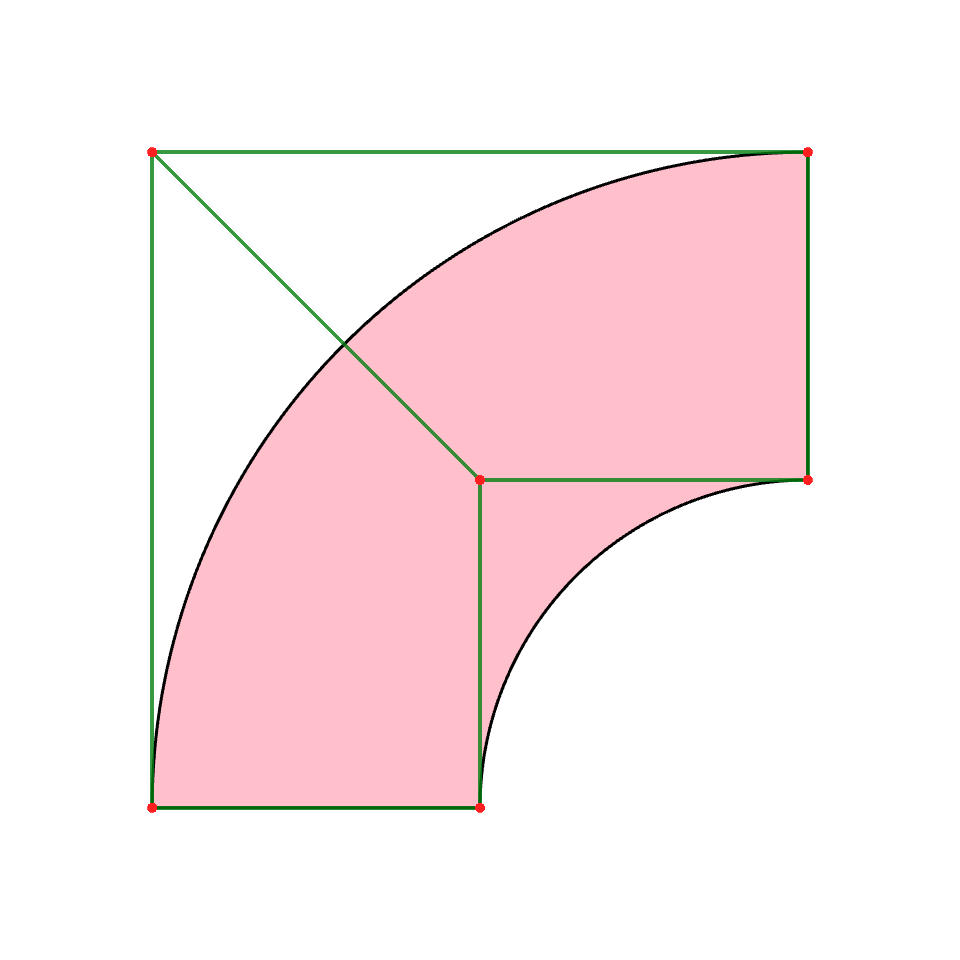
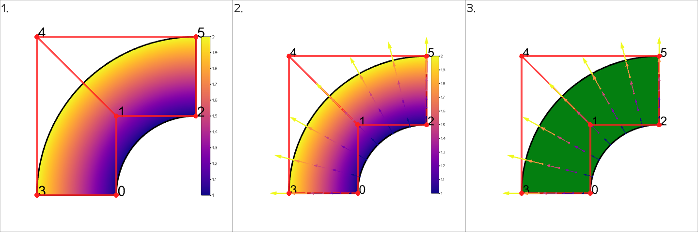

# Visualization
One of the highlights of splinepy is that we can visualize splines.
Most of the classes have their own `show()` function to visualize current state of each object.
Visualizations utilize mesh types and data structures of [gustaf](https://tataratat.github.io/gustaf/).
Then, actual rendering happens with [vedo](https://vedo.embl.es) - a powerful scientific analysis and visualization library - check them out for details!

The following will give a brief introduction to spline visualization.

## Creating a basic NURBS

Here, we start by creating a NURBS object with array-like inputs.
```python
import splinepy

# Initialize nurbs with any array-like input
nurbs = splinepy.NURBS(
    degrees=[2, 1],
    knot_vectors=[
        [0, 0, 0, 1, 1, 1],
        [0, 0, 1, 1],
    ],
    control_points=[
        [-1.0, 0.0],
        [-1.0, 1.0],
        [0.0, 1.0],
        [-2.0, 0.0],
        [-2.0, 2.0],
        [0.0, 2.0],
    ],
    weights=[
        [1.0],
        [2**-0.5],
        [1.0],
        [1.0],
        [2**-0.5],
        [1.0],
    ],
)

# vizusalize
nurbs.show()
```


## Setting show_options

You can also customize visualization by setting ***show_options***:
```python
nurbs.show_options["c"] = "pink"
nurbs.show_options["control_point_ids"] = False

# You can use `update()` to set multiple options at once
# As visualization runs through mesh based engines, you can set sampling
# resolutions per dimension.
# In case of int, it will apply that for all dimension
nurbs.show_options.update(control_mesh_c="green", resolutions=[201, 3])

nurbs.show()
```


## Plotting data on spline

You can easily plot data on splines.
Scalar data can be represented with a colormap and vector data can be represented with arrows.
You can take a look at [this example](https://github.com/tataratat/splinepy/blob/main/examples/show_spline_data.py) for detailed introduction.
```python
# set data - we will plot self spline, which will plot coordinates
nurbs.spline_data["coords"] = nurbs

# then, set in show_options the name of the data
# "data" keyword will process any data as scalar - in case of vector data,
# it will take the norms
nurbs.show_options["data"] = "coords"
nurbs.show_options["scalarbar3d"] = True
nurbs.show()  # Nr. 1

# at the same time, you can plot vector data
# the keyword here is "arrow_data"
nurbs.show_options["arrow_data"] = "coords"

# by default, this will place an arrow at each sampling location which most of
# the time is too many. With "arrow_data_on", you can specify locations
nurbs.show_options["arrow_data_on"] = splinepy.uniform_query(
    nurbs.parametric_bounds, [7, 5]
)
nurbs.show()  # Nr. 2

# to turn off, just set None or pop()
nurbs.show_options.pop("data")
nurbs.show()  # Nr. 3
```

## Examples
Take a look at the <a href='https://github.com/tataratat/splinepy/tree/main/examples'>examples folder</a> for more!


## Notebook plotting

You can also plot your splines inside a notebook. For this you need to change the vedo backend to 'k3d'. To do this you need to add the following lines to the top of the notebook.

```
import vedo

vedo.settings.default_backend = "k3d"
```

After this most functionality of the normal plotting should be available to you. Please write an issue if you find something that you can plot in a script but not in a notebook. There is one known issue regarding number of Line objects that we can plot (limited to 200 from `vedo`). We are working on a solution, but meanwhile, plotting curves is limited to resolutions of 201; for 2D/3D splines you can turn off `knots` in `show_options`. An example is provided in the folder `examples/ipynb`.
